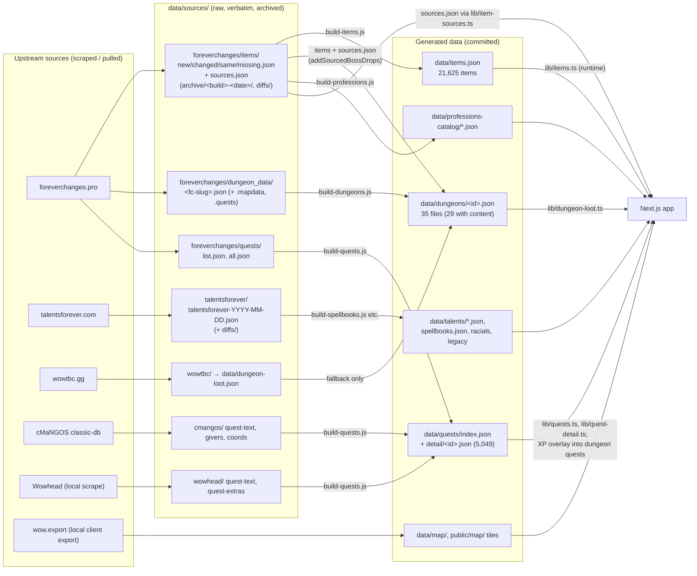

# Site overview (2026-10-06)

One document to orient a new session without reading every handoff. It describes the site **as of branch `leveling-verification-overlay` at `d7687a6d`** (one commit ahead of `main`/`origin/main` at `42ebe298`). Verified against the code, a fresh `npm run build`, and a production server on 2026-10-06. Findings from the same pass (regressions, security, tech debt, ideas) are in [[Weekly-Audit-2026-10-06]].

Back to [[Overview]] · [[Architecture]] · [[Roadmap]]

**Precedence:** `CLAUDE.md` (repo root, auto-loaded) is the authoritative short reference and holds the standing rules. [[Architecture]] holds rationale. This doc is a dated snapshot that ties them together. Where this doc and the code disagree, the code wins. Re-verify before relying on a number here.

---

## 1. What the site is

Forevercraft (forevercraft.app) is a free, fan-made hub for **World of Warcraft: Forever** (beta started 2026-09-17; launch **2026-11-04**). It has three pillars:

1. **Planner:** class tabs, talent tree, shareable build URLs, per-device saved builds.
2. **Reference:** racials, legacy perks, spellbooks, dungeons and loot, quests, items, professions, crafting calculator, world map.
3. **Content:** blog (13 posts) and guides (pipeline live, zero guide MDX files).

It isn't monetized or affiliated with Blizzard. Phase 1 has no database for game data: everything is static JSON + MDX. The only server-side state is the anonymous build-tracking counters in Upstash Redis (§5.4).

---

## 2. Route map

From `app/` and the `npm run build` route table (5,160 prerendered pages). Legend: **○** static, **●** SSG via `generateStaticParams`, **ƒ** rendered on demand.

### Pages

| Route | Mode | What it does |
|---|---|---|
| `/` | ○ | Home: hero, quick links to planner/reference, latest blog posts. Inherits root-layout metadata (no own `metadata` export). |
| `/planner/[[...slug]]` | ƒ | Talent planner. `/planner/<classId>/<buildCode>`; legacy 3-segment `/<class>/<race>/<code>` URLs redirect via `parseSlug()`. Race is reference-only. Embeds the class spellbook (collapsed) and the racials table. Fires anonymous `opened`/`saved`/`shared` events (§5.4). |
| `/reference` | ○ | Reference landing (cards). |
| `/reference/racials` | ○ | Race/racial reference (`RaceReferenceTable`, also embedded in the planner). |
| `/reference/legacy-perks` | ○ | Legacy Perk trees (3 columns, prereqs, gates). |
| `/reference/class-spellbooks` | ○ | Spellbook "book" UI per class, with the Compare-to-Classic word diff. |
| `/reference/dungeons` | ○ | Dungeon level-range timeline (desktop) and mobile list, plus an inline loot panel per dungeon. **~1.98 MB HTML.** |
| `/reference/dungeons/loot` | ○ | Loot index table: level, roster count (bosses + rares), quest count per dungeon. |
| `/reference/dungeons/loot/[slug]` | ● (29) | Per-dungeon page: header art, sticky nav (Loot / Quests / Where quests start), boss cards (abilities, color-coded tags, loot pills), dungeon quests with faction filter, quest-giver table, sidebar (quick stats, jump-nav with scroll-spy and Rare badges, dungeon map, author notes). `dynamicParams = false`. |
| `/reference/items` | ƒ | 21,625-item catalog, filtered and paginated **server-side** (`lib/items.ts` `queryItems`); the catalog never ships to the client. |
| `/items/[itemId]` | ○ (`force-static`, no params) | Item page: tooltip, Classic diff, status callout, sources (`sources.json`), "back to" link from the `?from=` params. Rendered on first request, then cached. `robots.index` only for new/changed items. |
| `/reference/quests` | ƒ | 5,049-quest sortable table. Location tabs, per-dungeon dropdown, search, Clear filters. Compact XP/money reward pills. |
| `/quests/[questId]` | ● (5,049) | Journal-style quest page: text (cMaNGOS, then Wowhead fallback), chains, rewards, zone mini-maps. `dynamicParams = false`. These pages are **5,049 of the 5,160** prerendered pages and the reason builds take ~3–4 minutes on Vercel. |
| `/reference/professions` | ○ | Profession listing. Verified leveling paths link normally; the rest show an "In the works" card. |
| `/reference/professions/[profession]` | ● (11) | 8 crafting professions (Recipes / Leveling 1 to 300 / Merchant's Favor / Camp) and 3 gathering professions (a separate page type). Client-side view/category/page/q filtering. Unverified leveling views sit under the `LevelingUnderConstruction` overlay. |
| `/reference/crafting-calculator` | ○ | Crafting calculator (client component, reads the normalized catalogs). **~2.08 MB HTML.** |
| `/reference/map/[continent]` | ● (2) | Leaflet world map (Eastern Kingdoms, Kalimdor): tile pyramid, zone borders/labels, entrance and flight-master markers, sidebar, URL-hash state. Development paused. `/reference/map` redirects (307) to Eastern Kingdoms. |
| `/guides`, `/guides/[slug]` | ○ / ● | Guides index (links to the profession leveling pages) and MDX guide pages. `content/guides/` doesn't exist yet. |
| `/blog`, `/blog/[slug]` | ○ / ● (13) | Blog index and MDX posts (incl. 7 profession write-ups). |
| `/whats-new` | ○ | In Game (`data/patch-notes/<build>.json`) and On the Site (`data/site-changelog.json`) tabs. Footer link only. |
| `/contact` | ○ | Embedded Google feedback form. |
| `/privacy` | ○ | Privacy policy, including the anonymous build-activity section. |

### Route handlers, metadata and APIs

| Route | Mode | What it does |
|---|---|---|
| `POST /api/builds/track` | ƒ | Records one anonymous build event (validated, rate-limited, deduped). 400 bad input / 429 limited / 204 otherwise. |
| `GET /api/cron/build-rollup` | ƒ | Daily rollup (Vercel Cron `0 6 * * *`), `Authorization: Bearer $CRON_SECRET`. Drains raw events into aggregate hashes. |
| `/planner/og/[classId]/[buildCode]` | ƒ | Per-build OG image (`next/og`, Node runtime). A route handler because a catch-all can't host `opengraph-image.tsx`. |
| `*/opengraph-image` | ○/● | Section OG images via `lib/og-template.tsx` `renderOgImage`. Backgrounds come from the generated literal-path map. |
| `/sitemap.xml` | ○ | Static routes, content, professions, 29 loot pages, and new/changed items only. **~2.4 MB.** |
| `/robots.txt`, `/icon.svg` | ○ | Metadata files. |
| Redirects (`next.config.ts`) | – | `/guides/dungeons` → `/reference/dungeons` (permanent), `/reference/map` → `/reference/map/eastern-kingdoms` (temporary). |

---

## 3. Current architecture

| Layer | Choice | Notes |
|---|---|---|
| Framework | **Next.js 16.3.8**, App Router, **Turbopack** build | Bumped from 16.3.5 on 2026-10-06 (security patch, uncommitted, see the audit). Read `node_modules/next/dist/docs/` before writing Next code (AGENTS.md). |
| UI | React 19.2, TypeScript 5, **Tailwind 4** (`@tailwindcss/postcss`), `lucide-react` | Theme tokens (`--background`, `--gold`, …). Two modes: Themed (dark, default) and Light ("readable", `localStorage` key `forevercraft:readable-mode`). |
| Content | MDX via `next-mdx-remote` + `gray-matter` | `lib/content.ts` shared loader (`lib/blog.ts` still separate). Frontmatter rules in `docs/adding-content.md`. |
| Map | **Leaflet** 1.9, client-only (`ssr:false` loader) | Tiles in `public/map/<continent>/tiles/` (excluded from all function traces). Server-read map JSON in `data/map/` via generated static imports. |
| Images | `next/image` with remote patterns `wow.zamimg.com` (icons) and `foreverchanges.pro` (dungeon art, boss portraits) | Hotlinked third-party assets. `sharp` is a devDependency used by `scripts/build-og-backgrounds.js` (Next still pulls its wasm into traces itself). |
| Hosting | **Vercel, Hobby plan** | Daily-only cron; ~1 h cron window; Deployment Storage was the constraint (97% of 10 GB) until old deployments were pruned 2026-10-06. |
| State (server) | **Upstash Redis** (Vercel Marketplace, Free tier, us-east-1) | Build tracking only. `@upstash/redis` REST client. Env: `UPSTASH_REDIS_REST_URL`, `UPSTASH_REDIS_REST_TOKEN`, `BUILD_TRACKING_SECRET`, `CRON_SECRET`. |
| State (client) | `localStorage` | Saved builds (`lib/saved-builds.ts`), anon tracking token, theme, quest faction filter. |
| Analytics | `@vercel/analytics` | |

### 3.1 Function-size constraints (the standing rule)

From `CLAUDE.md`: **no server code may read `public/` or a large data file through a runtime-variable path, or load a whole big file per request.** Next's tracer can't resolve a variable path, so it bundles the whole directory into every function that can reach it. That bug once put ~120 MB into all 102 functions (2026-09-30). The tools for avoiding it:

- **Literal-path lookup maps generated at `prebuild`:** `lib/og-backgrounds.generated.ts` (OG backgrounds), `lib/map-data.generated.ts` (map JSON).
- **`outputFileTracingExcludes`** in `next.config.ts` for `public/map/*/tiles/**`.
- **Build-time-only reads** for SSG pages (`dynamicParams = false`).
- After any new server-side read: `npm run build` (not bare `next build`, because `prebuild` must run), then check `.next/server/app/**/*.nft.json`.

Measured 2026-10-06 (local trace sizes, largest first): professions page 40.0 MB, crafting calculator 39.7 MB, `/reference/items` 38.0 MB, `/quests/[questId]` 29.0 MB, dungeon pages ~27–28 MB. All are far under Vercel's limit. Known contributors: `data/items.json` (10.3 MB), `sharp-wasm32` (8.6 MB, pulled in by Next itself), `data/quests/detail/*` (5,049 shards in the quest trace), and three dungeon PNGs (~4.4 MB) committed under `data/dungeons/` that `lib/dungeon-loot.ts`'s directory read drags into 10 traces. Details are in [[Weekly-Audit-2026-10-06]] §3.

### 3.2 Key code modules

| Area | Modules |
|---|---|
| Planner | `app/planner/[[...slug]]/PlannerClient.tsx`, `lib/build-code.ts` (**versioned** positional codes, currently `CURRENT_VERSION` 5 with frozen `LEGACY`/V2/V3/V4 tree-order snapshots; v4 = Druid Feral reshape 10-01, v5 = Warrior Fury/Protection hotfix 10-03, `f74707fb`), `lib/saved-builds.ts`, `lib/active-tooltip.ts` (single tooltip owner), `TalentNode.tsx`/`TalentTreeGrid.tsx` |
| Dungeons | `lib/dungeon-loot.ts` (**server-only**, reads `data/dungeons/`, applies quest-XP overlay), `lib/dungeon-roster.ts` (**client-safe**: `isNamedBoss`, `rosterCounts`), `BossCard`, `LootItemPill`, `DungeonLootSidebar`, `DungeonJumpNav`, `DungeonStickyNav`, `LootQuestRewardsCard`, `QuestCard`, `QuestGiversTable`, `DungeonInlinePanel` |
| Items | `lib/items.ts` (loads `data/items.json`, `queryItems`, `isIndexableItemStatus`), `lib/item-sources.ts` (`sources.json`), `lib/item-display-status.ts` (sell-price-only → "same" for display), `lib/item-link.ts` + `ItemLinkSource` context |
| Quests | `lib/quests.ts` (listing/query over `data/quests/index.json`), `lib/quest-detail.ts` (one shard per page at build time), `QuestJournal`, `QuestsTable`, `RewardPills`, `QuestDungeonFilter` |
| Professions | `lib/profession-recipes.ts`, `lib/gathering-professions.ts`, `lib/profession-leveling-status.ts` (`LEVELING_VERIFIED_PROFESSION_IDS` = blacksmithing, first-aid), `ProfessionExplorer`, `LevelingUnderConstruction`, `InTheWorksCard`, `CraftingCalculator` |
| Build tracking | `lib/build-events.ts` (schema/validation), `lib/build-tracking-server.ts` (Redis, HMAC, rate limits, dedup), `lib/build-tracking-client.ts` (token, `sendBeacon`), `lib/build-rollup.ts` |
| OG / SEO | `lib/og-template.tsx`, `lib/og-backgrounds.generated.ts`, `app/sitemap.ts`, `app/robots.ts` |

---

## 4. Data pipeline, end to end

### 4.1 The picture

### 4.2 What each piece is and does

| Piece | Location | Produced by | Read by | What it is |
|---|---|---|---|---|
| **Item bucket files** | `data/sources/foreverchanges/items/{new,changed,same,missing}.json` | Bulk export from foreverchanges.pro. **The producer isn't in the repo**; files are dropped in by hand. | `build-items.js`, `build-dungeons.js` (stale-snapshot rule), `diff-foreverchanges-items.js` | The full item catalog, split by foreverchanges' Forever-vs-Classic bucket. Short keys: `i` id, `n` name, `q` quality, `l` ilvl, `r` req level, `s` slot, `c`/`u` class/subclass, `t` bucket, `k` icon, `x` tooltip lines, `v` stat map, `p`/`d` weapon speed/dps. Current pull **1.60.1.70235** (2026-10-05). |
| **`sources.json`** | same folder | Same bulk export (producer not in repo) | `lib/item-sources.ts` (item page "drops from"), `build-dungeons.js` (`addSourcedBossDrops`) | `{itemId: [code, label, location]}`, **one source per item**. Codes: `q` quest, `v` vendor, `C` crafted, `m` creature, `w` world drop, `B` dungeon, `R` rare, `Q`. Can't express multi-boss drops; 364 entries use generic labels ("Several bosses", "Any enemy"). Every dungeon drop is `B`, so it **can't** split bosses from rares. (`data/sources/README.md` still says no build script reads it; that's stale.) |
| **Archive + diffs** | `items/archive/<build>-<date>/`, `items/diffs/` | Moved by hand before each pull; `scripts/diff-foreverchanges-items.js <old> <new>` | Humans | Every previous pull kept forever. The diff script compares only `n q l r s c u k x y`, **skips `sources.json` and `p/d/v/t`**, and truncates tooltips at 160 chars in its markdown. Read the JSON for a real check. |
| **`data/items.json`** | `data/` | `node scripts/build-items.js` (via `scripts/lib/fc-item.js` `fcItemToUnified`) | `lib/items.ts` at runtime (`/reference/items`, `/items/[id]`, sitemap, profession resolution), `build-dungeons.js` | Master catalog, 21,625 items, ~10.3 MB. `status` = bucket (`rebuilt` folds into `new`). Slot strings are inconsistent; 9,479 items have `slot: null` (BIS prerequisite). |
| **`dungeon_data/`** | `data/sources/foreverchanges/dungeon_data/<fc-slug>.json` (29 dungeons) + `.mapdata.json`, `.quests.json`, `raw-html/` | `fetch-foreverchanges-dungeon-loot.js --slugs=…` (live `https://foreverchanges.pro/dungeons/<fc>.json`), `extract-foreverchanges-dungeon-maps.js`, `extract-foreverchanges-quests.js` | `build-dungeons.js` | **The only source of boss rosters and per-boss loot.** Entries carry `kind` (`boss`/`rare`/`trash`/`object`/`quest`) and portraits. Our id ↔ fc slug mapping lives in `scripts/dungeon-source-map.js` (e.g. `deadmines` → `the-deadmines`). A re-pull overwrites. 10 raw files were refreshed on 2026-10-06 (RFK, plus nine with the 70235 pull including The Stockade); **the other 19 predate the live endpoint**. |
| **`data/dungeons/<id>.json`** | `data/dungeons/` (35 files) | `node scripts/build-dungeons.js` | `lib/dungeon-loot.ts` (`loadAll()` reads the **whole directory**) | Normalized per-dungeon bosses, items (full records baked in at build time), quests, pin map, art URL. One source wins per dungeon per data type (`bossLootSource`/`questSource`); never blended item by item. **No correction-preservation step**: hand edits are lost on rebuild. Quest XP is overridden at load time from `data/quests/index.json` (`applyIndexXp`). |
| **wowtbc fallback** | `data/sources/wowtbc/` → `data/dungeon-loot.json` | `parse-wowtbc-loot.js`, `build-dungeon-loot.js` | `build-dungeons.js` | Used only where foreverchanges has nothing for a dungeon's data type. Currently none. |
| **Quests** | `foreverchanges/quests/{list,all}.json`, `cmangos/*`, `wowhead/*` → `data/quests/index.json` (3.3 MB) + `data/quests/detail/<id>.json` (5,049 shards, ~35 MB on disk) + `dungeon-membership.json` | `scrape-foreverchanges-quest-pages.js`, `build-cmangos-quest-*.js`, `build-wowhead-quest-text.js`, `build-quests.js`; `build-quest-dungeon-index.js` (**prebuild**) | `lib/quests.ts`, `lib/quest-detail.ts`, `lib/dungeon-loot.ts` (XP) | Run order matters for cMaNGOS: givers, then coords (re-running givers alone wipes `point`s). |
| **Talents / spellbooks** | `talentsforever/talentsforever-YYYY-MM-DD.json` (immutable) → `data/talents/*.json`, `spellbooks.json`, `talent-spell-links.json`, racials, legacy perks | `diff-talentsforever.js`, `build-spellbooks.js`, `build-talent-spell-links.js`, hand application by name match | Planner, spellbooks, racials, What's New | Daily-diff workflow (CLAUDE.md). Tree membership/order changes need a `lib/build-code.ts` version bump. |
| **Professions** | `data/professions/*` → `data/professions-catalog/*.json` | `build-professions.js`, `build-gathering-professions.js`, `fetch-profession-*.js` | Profession pages, crafting calculator | Crafting catalogs reference items as `{itemId, name}`; gathering catalogs still embed records. |
| **Map** | wow.export tiles/DB2 → `public/map/<continent>/tiles/`, `data/map/<continent>/` | `slice-map-tiles.js`, `build-zone-areas.js`, `build-map-entrances.js`, `build-flight-masters.js`, `build-map-data-imports.js` (**prebuild**) | Map page | |
| **OG backgrounds** | `assets/og-backgrounds/` + `lib/og-backgrounds.generated.ts` | `build-og-backgrounds.js` (**prebuild**) | OG routes | Pre-shrunk 1600px JPEGs (satori can't decode WebP). |

### 4.3 How they relate (the parts that have caused back-and-forth)

1. **Two copies of item data exist on purpose, and they drift.** `data/items.json` is resolved **live** by item pages, quest pages and professions. `data/dungeons/*.json` **bakes** full item records in at `build-dungeons.js` time. Pull a new item catalog without re-running `build-dungeons.js` and the dungeon pages go stale (happened 2026-10-02; 157 stale records were found and fixed 2026-10-06). **Rule: every item pull ends with `build-items.js`, then `build-dungeons.js`, then an item-level (not count-level) drift check.**
2. **Boss attribution = `dungeon_data` first, `sources.json` second.** The dungeon endpoint gives per-boss placement (including multi-boss drops such as Ace of Elementals under Lord Incendius and Hydrospawn). `sources.json` can only *add* a missing drop when its label names a boss in that dungeon exactly. It never removes or moves. Generic labels are ignored.
3. **Roster counts come from `kind` + portrait, not `sources.json`.** `isNamedBoss` = not trash, and (`boss`/`rare` or has a portrait). Rares = `kind === "rare"`. Trash groups and containers still render their loot but aren't counted.
4. **Quest XP has one source of truth:** `data/quests/index.json` (post-nerf). Dungeon quest XP strings in `data/dungeons/*.json` are stale by design and overwritten at load.
5. **Generated files are never hand-edited.** Fix the raw source, or add an override mechanism (none exists yet; see the audit).

### 4.4 foreverchanges pull / diff / sync runbook (current)

Condensed from the 2026-10-06 data-pipeline handoffs (`items-pull-70205-and-loot-attribution`, `foreverchanges-pull-diff-and-sync`, `client-bundle-fix-and-roster-split`):

1. **Items:** fetch `https://foreverchanges.pro/items/{new,changed,same,missing,sources}.json` into a staging folder; confirm all five share one `forever_build`. Compare bytes too, because a republish can keep the build stamp (2026-10-06: `new.json` gained an item under the same 70235 stamp).
2. Archive the current five into `items/archive/<old build>-<old date>/`, then move the new ones in.
3. `node scripts/diff-foreverchanges-items.js items/archive/<old> items` (explicit paths). **Also** compare `sources.json` and the `p/d/v/t` fields by hand, and read full tooltips for anything flagged.
4. `node scripts/build-items.js`. Check counts and that every raw record matches name/quality/ilvl/req level (0 mismatches).
5. **Dungeons:** for each slug, fetch `https://foreverchanges.pro/dungeons/<fc>.json` to scratch and compare **per-boss item lists** (not just counts) with `dungeon_data/`. Re-pull only drifted slugs with `fetch-foreverchanges-dungeon-loot.js --slugs=…`.
6. `node scripts/build-dungeons.js`. `git diff --stat data/dungeons/` should show only the expected files.
7. Check rosters (`rosterCounts`), quest XP vs index (332 quests), and the multi-boss items via the real loader (`npx tsx`).
8. `npm run build`, restart any running dev server (`lib/dungeon-loot.ts` caches at module level), and check pages in a browser.

---

## 5. Feature notes that matter for new work

### 5.1 Planner
Versioned build codes (see CLAUDE.md). Mobile: tap adds, 450 ms long-press peeks, minus button removes. Desktop: 43 px icons / 24 px gap, deliberately square cells. Keyboard selection, undo/redo, and hold-to-fill shipped 2026-10-01 to 10-03.

### 5.2 Dungeon loot pages
Composition lives in `app/reference/dungeons/loot/[slug]/page.tsx` (191 lines): header art (560 px on `sm+`, natural ratio, right-edge fade to `var(--background)`; full-width, stacked and unfaded on phones), sticky nav, boss cards, quests, quest-giver table, sidebar. The client-safe/server-only split (`dungeon-roster.ts` vs `dungeon-loot.ts`) is load-bearing: **a value import from `dungeon-loot.ts` into any client component puts `fs` in the browser bundle.**

### 5.3 Professions leveling verification
Every profession with leveling data shows its Leveling tab. Paths not in `LEVELING_VERIFIED_PROFESSION_IDS` (currently `blacksmithing`, `first-aid`) render grayed, `inert`, under a scrim with caution tape and a "not verified" card linking `/contact`. To verify one, add its id. Skinning has no leveling data; its "What to Skin" bracket view isn't overlaid (see the audit).

### 5.4 Build tracking (Upstash Redis)
- Client: random 32-hex token in `localStorage` (`forevercraft:anon-token`), events sent with `sendBeacon` (fallback `fetch` keepalive), fire-and-forget.
- Server: validate (`type`, known `classId`, `buildCode` `^[0-9a-z-]{1,200}$`, token pattern), then rate-limit (30/min per hashed IP, 100/day per hashed token), then dedup (`SET NX`, one per type/token/class/build/UTC day), then `RPUSH` to `builds:events:raw` (capped 100k). Only HMAC hashes are stored.
- Rollup: daily, lock, `LRANGE` ≤50k, drop >90 days and malformed, `HINCRBY` into `builds:agg:classes` / `builds:agg:talents` / `builds:agg:meta`, then `LTRIM`. At-least-once.
- **Nothing reads the aggregates yet.** No Popular Builds UI. The production aggregates still hold 4 test events from 2026-10-06.
- **Local caution:** `.env.local` holds real production credentials, so `npm run dev`/`next start` locally **writes to production Redis** when a planner build URL is opened in a browser.

---

## 6. What happened this week (2026-09-30 → 2026-10-06)

Pulled from every handoff in `03-Handoffs/` dated in the window, plus `git log`. One line per item; open the handoff for detail.

### Infrastructure
- **Vercel function size** (09-30, `infrastructure/2026-09-30-vercel-function-size`): 121 MB → 24.2 MB per function after fixing the variable-path `public/` read; uniform dashboard sizes still unexplained (open, not urgent).
- **Build tracking** (10-06, `infrastructure/2026-10-06-build-tracking-infrastructure`): Upstash Redis capture route, daily rollup cron, privacy-page disclosure; live-verified against real Redis; dedup added (`6c72670c`). Build-time and Vercel-usage investigation in [[Architecture]].

### Data pipeline
- **Talents/spellbooks:** beta build 70170 sync with Druid tree change and build-code v4 (10-01/02); Warrior Oct 1 patch data with build-code v5 (`f74707fb`, 10-03); talentsforever 10-04 sync (`e2633372`); talent-granted spell levels (09-30).
- **Items catalog:** 69913 → 70170 (10-02), → 70205 (10-06, +64 items, `sources.json` wired into dungeon loot as `addSourcedBossDrops`), → **70235** (10-06, 12 bucket moves, Booty Bay Bruiser's Buckshot lost its Use line).
- **Dungeon data:** foreverchanges dungeon scrape (maps, bosses, abilities, 10-02); quest/item sync fix for stale baked item data (10-02); generic-label ID audit and reconciliation (no reattribution needed, 10-06); boss-roster fix (render-layer `isNamedBoss`, 10-06); RFK + Stockade restored from live; boss/rare split; nine dungeons rebuilt with the 70235 pull.
- **Quests:** full pipeline (foreverchanges scrape + cMaNGOS + Wowhead) into `index.json` + 5,049 detail shards (10-02 → 10-03); quest-XP nerf overlay on dungeon pages (`ec4240fc`).

### Reference UI
- **Dungeon loot pages:** sidebar with jump-nav and scroll-spy (10-01), dungeon maps from wow.export BLPs (10-01), crash and multi-floor fixes (10-02), faction filter, "Where quests start" table, per-dungeon quest dropdown (10-06), boss card wrapping pill layout and color-coded ability tags, quest XP/money icon pills, header art reworked (borderless 560 px, right fade; Important callout and masthead restyle were tried and **reverted**).
- **Items:** back-link context (`?from=`), sell-price-only diffs suppressed in tooltips and callouts (`bc17fe7f`), ID search.
- **Quests:** journal-style detail pages, mini-maps from zone images, sortable table, Clear filters, reward pills.
- **Planner:** keyboard navigation, Enter/Backspace input, hold-to-fill, undo/redo, controls help panel, talent tooltip overhaul (10-01).
- **Professions:** the leveling gate was reworked twice: hidden tab + URL fallback, then a "not ready" block (blocked by a duplicate-view symptom), then the **overlay** that shipped (`d7687a6d`, branch `leveling-verification-overlay`).

### Planning
- BIS builder competitor analysis and design doc (10-06, `planning/2026-10-06-bis-competitor-analysis-and-roadmap`); roadmap section for 10/7–10/14.

---

## 7. Roadmap state (as of 2026-10-06)

Source: [[Roadmap]] (Week of 10/7–10/14 + older sections) and CLAUDE.md "Next up" / "Open items".

**Week of 2026-10-07 → 10-14**
- BIS builder: design done; **build waits for level-60 data**. Prerequisite either way: an `items.json` slot-mapping table.
- YouTube-transcript blog pipeline: scope as synthesis + commentary, never transcript dumps.
- Profession leveling 1–300 refresh: one session per profession; promote each to `LEVELING_VERIFIED_PROFESSION_IDS` once done.
- Class guide enhancements: macros + a "changed from Classic" section per class (depends on the Classic-description backfill, ~63 spells left).

**Launch-critical (2026-11-04)**
- wow.export extraction of icons, dungeon loot, items and tooltips. **Decide the November data layout first** (per-item shards vs Postgres); today's whole-file `items.json` read doesn't scale.
- 2–3+ data-refresh passes as beta patches land.

**Next up / open, carried from earlier weeks**
- Popular Builds **display** (collection is live): decide the dedup/export design and whether to reset the test aggregates.
- `lib/quest-detail.ts` variable-path read (Turbopack 10,098-file warning).
- Sell-price-only items still indexable (104 items): decide whether `isIndexableItemStatus` uses `displayStatus`.
- Dungeon raw data: 19 of 29 raw files not refreshed from live; no correction-preservation mechanism; diff script gaps.
- `uncertain.json` (101 recipe categories), `lib/blog.ts` migration, first real guide MDX, home-page metadata, OG images for items/loot.
- Map (paused): GM Island re-tile, real entrance icons (FileDataID 1121272), duplicate Naxxramas row.
- Mobile passes: `DungeonInlinePanel` two-column sub-layout, Legacy Perks touch.

---

## 8. Working conventions worth knowing on day one

- **Handoffs:** `03-Handoffs/<category>/YYYY-MM-DD-topic.md` using `99-Templates/Handoff-Template.md`. The `03-Handoffs/` folder is **gitignored** (local only); `01-Projects/` and `04-Features/` are tracked.
- **Stop-before-commit** is the default request. Say the commit state plainly.
- **Ports:** a dev server is often already on 3000 or 3100 serving stale code. Check the owner before trusting a curl. `lib/dungeon-loot.ts` caches at module level, so restart after rebuilding dungeon JSON.
- **`curl` proves nothing for client-side views** (professions `?view=`); use a browser.
- **Mobile checks:** Chrome `resize_window` doesn't change `innerWidth` here. A same-origin 390 px iframe is a genuine breakpoint test; a real narrow window is better.
- **Build with `npm run build`** (runs `prebuild`), never bare `next build`.
- **Patch notes `sourceUrl`** may only be an official Blizzard forum post.
